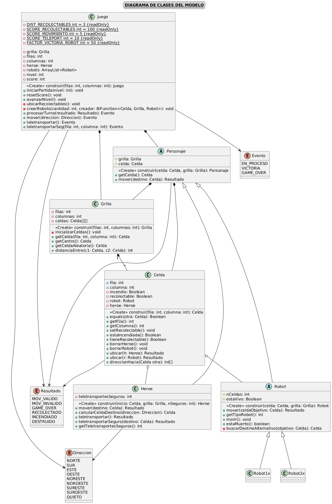

# Robots: Robots
### Implementación del videojuego _Robots_ para la materia TB025 Paradigmas de Programación, curso Essaya

## Integrantes:
- Pilar Montilla - 111811
- Facundo Barrasso - 111942

## Fecha de entrega:

___
